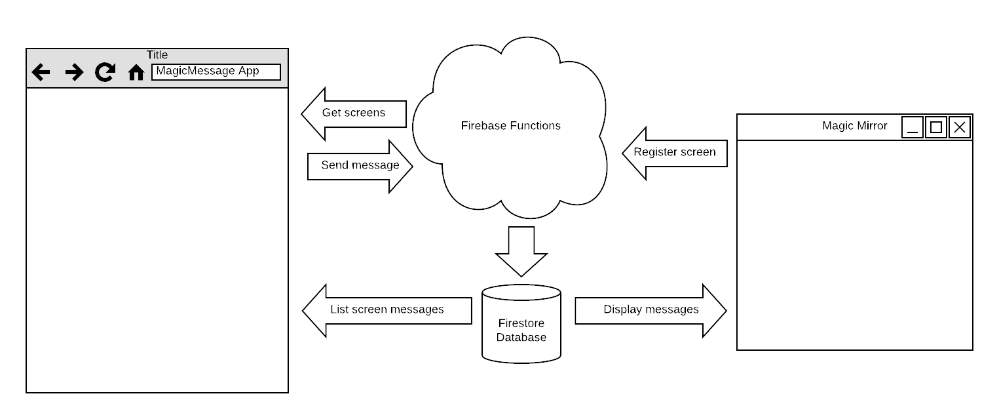

# Magic

This is a documentation repository for my MagicMirror projects.

I have created a couple of magic mirros based on [MagicMirror2](https://magicmirror.builders/). Actually one of them is not a mirror, just a screen hanging in my home kitchen in a corner up under the ceiling. 

To adapt the magic mirror concept to my own needs, I have created several modules on my own. These can be found in other repositories here:

* [MMM-NesteBussAtB](https://github.com/ottopaulsen/MMM-NesteBussAtB) is used to show the next buses leaving nearby bus stops in Trondheim.
* [MMM-MQTT](https://github.com/ottopaulsen/MMM-MQTT) is used to display contents from MQTT messages. I use it to display data from my smoke cabinet. See my [Smoky](https://github.com/ottopaulsen/Smoky) repository.
* [MMM-MessageToMirror](https://github.com/ottopaulsen/MMM-MessageToMirror) This is not complete yet. It is a module combined with a web app that is used to send messages to be displayed on the magic mirror.

## Magic Message

The magic message project idea came from my daughter. I use to send an SMS to my wife when I leave work, so she can time when the dinner is ready (yes, she is nice, and I love her). However, some times it is not my wife that is home preparing dinner, but one of my kids. So the idea came from my oldest, Hilde, when we got the info-screen in our kitchen. "Can't you just send the message to the screen, so the right person gets it no matter who is making dinner?". But of course. I would love to do that.

The problem could have been solved a lot easier than I have done it, for example using the Slack module. However, I wanted to use this oportunity to expand my knowledge on some specific technologies. So here is what I am building: 



* An mobile app to send the message. Here I am using Ionic, learning both mobile development and Angular.
* A Firebase functions module used to receive the messages, as well as some other functions.
* A Firestore database to save messages, so that they can retain mirror restarts.
* A MagicMirror module to display the messages directly frm the Firestore database.

This makes a rather complicated architecture, and of course, a lot more complicated than absolutely necessary. The reason is just that I wanted to learn those things. But it is kind of cool.

### Repositories

Here are the repositories for the Magic Message solution:

[Magic Message App](https://github.com/ottopaulsen/magic-message-app) - Message sending client

[Firebase Functions](https://github.com/ottopaulsen/magic-message-functions) - Server module

[MMM-MessageToMirror](https://github.com/ottopaulsen/MMM-MessageToMirror) - Magic Mirror module.

The database has no own repository, but is described below.

### Firestore Database

I am using Googles new Firestore database to store messages. All you need to do is to create a Firebase project and a Firestore database, and get the configuration data into the other systems. You can use the same firebase project for both the functions and the database.

Here are the security rules for the database:

``` javascript
service cloud.firestore {
  match /databases/{database}/documents {
    match /screens/{screen} {
      allow get: if true; // Read if you know the screen id
      allow list: if request.auth.uid == userId; // Cannot list all screens
      allow write: if request.auth.uid == userId;
    }
    match /screens/{screen}/messages/{message} {
      allow list: if true; // Read messages
    }
  }
}
```

The `request.auth.uid == userId` rules makes sure that writing only can be donw through the firebase functions. (Hopefully...)

### Security

If I want to publish the MagicMessage module, it has to have some level of security. At the same time I don't want to make it too complicated to set up and use it. The solution is as follows:

* The user has to log in to be able to send messages. I use Google authentication for this, so you must have a Google account to use this. Through this, I get the email address. This is used to configure who are allowed to send messages to the mirror. It is also used to let you select which mirror you want to send message to, in case you have ccess to ultiple mirrors.

* The screen is registering at startup, with a unique id. Through the module configuration, this id is connected to your email address. This is stored in the firestore database through a firebase function. This function is open, so the screen can register itself with no authentication. Of course, here is a potential problem, but it there is not much use in registering a lot of fake screens, other than fucking up the system so that I have to close it down.

* The database is secured so that only the firebase functions can write to it, securing that only the legal stuff is written. In order to read messages, you have to know the unique screen id, and only the screen knows that, so it should be safe enough.

Currently you will be using my firebase function and my frestore database if you are using this solution, unless you set up your own server. If the usage is climbing to a level where I have to stat paying Google for this, I may have to close it down. That may happen without any notice.


